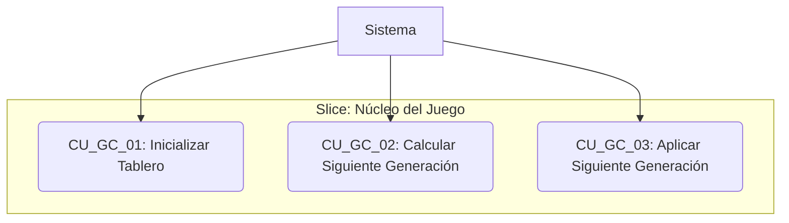
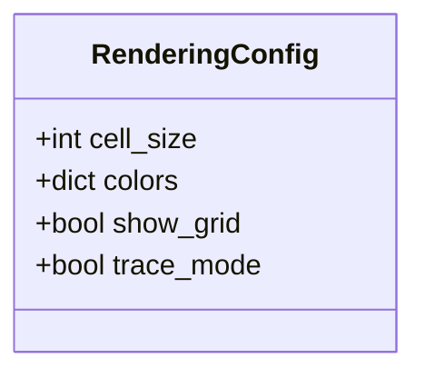
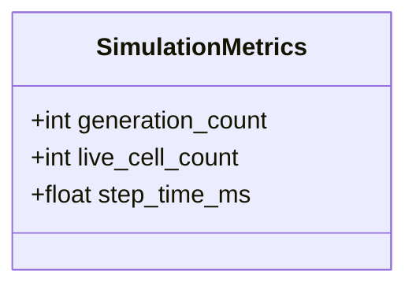

# Etapa 4: Diseño Detallado por Slices

Esta etapa se enfoca en el diseño detallado de cada Vertical Slice identificado en la Etapa 3. Se realizará de manera iterativa para cada slice.

## Slice Actual: Núcleo del Juego (Game Core)

Este slice contiene la lógica fundamental del Juego de la Vida, gestionando el estado del tablero y aplicando las reglas de evolución.

### Tarea 4.1: Diseño de Entidades y Modelos de Datos (para Game Core)

Basado en las entidades preliminares y la responsabilidad del slice, las entidades principales son `Board` y `Cell`.

- **Entidad `Cell`:**

  - Atributos:
    - `state`: Estado de la célula (ej. `CellState.ALIVE` o `CellState.DEAD`). Podría ser un `Enum`.
  - Métodos:
    - Posiblemente métodos para cambiar de estado o verificar estado.

- **Entidad `Board`:**
  - Atributos:
    - `width`: Ancho del tablero.
    - `height`: Alto del tablero.
    - `grid`: Una estructura de datos (ej. lista de listas o array de NumPy) para almacenar las `Cell`s.
  - Métodos:
    - `get_cell(x, y)`: Obtiene una célula en una posición específica.
    - `set_cell(x, y, state)`: Establece el estado de una célula en una posición específica.
    - `get_neighbors(x, y)`: Obtiene las células vecinas de una célula en una posición.
    - `calculate_next_state(x, y)`: Calcula el próximo estado de una célula basándose en sus vecinos y las reglas del juego.
    - `apply_next_state()`: Aplica los estados calculados para pasar a la siguiente generación.
    - `initialize(initial_state)`: Inicializa el tablero con un estado dado.
    - `clear()`: Establece todas las células a estado muerto.

#### Diagrama de Clases (Mermaid)

```mermaid
classDiagram
    class Cell {
        +CellState state
    }

    class Board {
        +int width
        +int height
        +Cell[][] grid
        +get_cell(x, y) Cell
        +set_cell(x, y, state) void
        +get_neighbors(x, y) List~Cell~
        +calculate_next_state(x, y) CellState
        +apply_next_state() void
        +initialize(initial_state) void
        +clear() void
    }

    enum CellState {
        ALIVE
        DEAD
    }

    Board "1" -- "*" Cell : contiene
```

**Resultado:** Diseño inicial de las entidades `Cell` y `Board` para el slice Game Core, incluyendo atributos, métodos y un diagrama de clases preliminar.

---

### Tarea 4.2: Diseño de Casos de Uso (para Game Core)

Se han definido los casos de uso principales para el slice "Núcleo del Juego".

- **CU_GC_01: Inicializar Tablero**
- **CU_GC_02: Calcular Siguiente Generación**
- **CU_GC_03: Aplicar Siguiente Generación**

#### Diagrama de Casos de Uso (Mermaid)



**Resultado:** Diagramas y descripciones de casos de uso específicos para el slice "Núcleo del Juego".

---

### Tarea 4.3: Diseño de Interfaces (Ports) (para Game Core)

Se han definido las interfaces (Ports) para el slice "Núcleo del Juego".

#### Subtarea 4.3.1.1: Identificar los puntos de interacción entre el Core y el mundo externo.

- Se identificaron puntos de interacción para inicialización, simulación, consulta y modificación del tablero.

#### Subtarea 4.3.1.2: Definir los contratos (métodos) para cada interfaz.

- Se definieron las siguientes interfaces (Primary Ports):
  - `IBoardInitializationPort`: `initialize_board`
  - `IGameSimulationPort`: `calculate_next_generation`, `apply_next_generation`
  - `IBoardQueryPort`: `get_board_state`, `get_cell_state`
  - `IBoardModificationPort`: `set_cell_state`, `clear_board`
- No se identificaron Secondary Ports necesarios dentro del Core de este slice.

#### Subtarea 4.3.1.3: Validar que las interfaces cumplan con el principio ISP (Interface Segregation Principle).

- La división en múltiples interfaces específicas (`IBoardInitializationPort`, `IGameSimulationPort`, `IBoardQueryPort`, `IBoardModificationPort`) cumple con el principio ISP.

**Resultado:** Interfaces (Ports) definidas y documentadas específicamente para el slice "Núcleo del Juego".

---

### Tarea 4.4: Diseño de Adaptadores (para Game Core)

Se ha diseñado la estructura de los adaptadores para el slice "Núcleo del Juego".

#### Subtarea 4.4.1: Diseñar adaptadores para bases de datos, APIs externas, etc.

- Para este slice, los adaptadores no interactúan con bases de datos o APIs externas. Actúan como implementaciones de los Ports que envuelven la lógica del Core.

#### Subtarea 4.4.2: Definir cómo se implementarán las interfaces en cada adaptador.

- Se propone un adaptador principal, `GameCoreAdapter`, que implementará las interfaces definidas en los Ports (`IBoardInitializationPort`, `IGameSimulationPort`, `IBoardQueryPort`, `IBoardModificationPort`).
- Este adaptador delegará las llamadas a los casos de uso y entidades correspondientes dentro del Core del slice.

**Resultado:** Diseño de adaptadores documentado específicamente para el slice "Núcleo del Juego".

---

**Slice "Núcleo del Juego" - Diseño Detallado Completado:** Se ha completado el diseño detallado para el slice "Núcleo del Juego", incluyendo entidades, casos de uso, interfaces (Ports) y adaptadores.

---

## Slice Actual: Control de Simulación (Simulation Control)

Este slice maneja el flujo de la simulación y coordina las interacciones con el núcleo del juego.

### Tarea 4.1: Diseño de Entidades y Modelos de Datos (para Simulation Control)

Este slice se enfoca principalmente en la orquestación y el estado del proceso de simulación, más que en entidades de dominio complejas propias. La entidad o modelo principal aquí es el estado de la simulación.

- **Modelo `SimulationState`:**
  - Representa el estado actual de la simulación (ej. `RUNNING`, `PAUSED`, `STOPPED`). Podría ser un `Enum`.

#### Diagrama de Clases (Mermaid)

```mermaid
classDiagram
    enum SimulationState {
        RUNNING
        PAUSED
        STOPPED
    }
```

**Resultado:** Diseño inicial del modelo `SimulationState` para el slice Control de Simulación.

---

### Tarea 4.2: Diseño de Casos de Uso (para Simulation Control)

Se han definido los casos de uso principales para el slice "Control de Simulación".

- **CU_SC_01: Iniciar Simulación**
- **CU_SC_02: Pausar Simulación**
- **CU_SC_03: Detener Simulación**
- **CU_SC_04: Avanzar Paso Único**
- **CU_SC_05: Limpiar Tablero**

#### Diagrama de Casos de Uso (Mermaid)

```mermaid
graph TD
    A[Usuario] --> CU_SC_01(CU_SC_01: Iniciar Simulación)
    A --> CU_SC_02(CU_SC_02: Pausar Simulación)
    A --> CU_SC_03(CU_SC_03: Detener Simulación)
    A --> CU_SC_04(CU_SC_04: Avanzar Paso Único)
    A --> CU_SC_05(CU_SC_05: Limpiar Tablero)
    B[Sistema] --> CU_SC_04

    subgraph "Slice: Control de Simulación"
        CU_SC_01
        CU_SC_02
        CU_SC_03
        CU_SC_04
        CU_SC_05
    end

    CU_SC_04 --> CU_GC_02(CU_GC_02: Calcular Siguiente Generación)
    CU_SC_04 --> CU_GC_03(CU_GC_03: Aplicar Siguiente Generación)
    CU_SC_05 --> GC_Mod_Port(IBoardModificationPort)

    subgraph "Slice: Núcleo del Juego"
        CU_GC_02
        CU_GC_03
    end

    GC_Mod_Port --> GC_Core(Core de Game Core)

    linkStyle 6,7,8 stroke:#000,stroke-width:2px,color:#000;
    linkStyle 9 stroke:#000,stroke-width:2px,color:#000;
```

**Resultado:** Diagramas y descripciones de casos de uso específicos para el slice "Control de Simulación".

---

### Tarea 4.3: Diseño de Interfaces (Ports) (para Simulation Control)

Se han definido las interfaces (Ports) para el slice "Control de Simulación".

#### Subtarea 4.3.1.1: Identificar los puntos de interacción entre el Core y el mundo externo.

- Se identificaron puntos de interacción para recibir comandos de control (desde la UI) y para interactuar con el slice "Núcleo del Juego".

#### Subtarea 4.3.1.2: Definir los contratos (métodos) para cada interfaz.

- Se definió la siguiente interfaz (Primary Port):
  - `ISimulationControlPort`: `start_simulation`, `pause_simulation`, `stop_simulation`, `step_simulation`, `clear_board`
- Se definieron las siguientes interfaces (Secondary Ports) que el Core de este slice utilizará para interactuar con el "Núcleo del Juego":
  - `IGameCoreSimulationPort`: `calculate_next_generation`, `apply_next_generation`
  - `IGameCoreModificationPort`: `clear_board`

#### Subtarea 4.3.1.3: Validar que las interfaces cumplan con el principio ISP (Interface Segregation Principle).

- La división en interfaces específicas (`ISimulationControlPort`, `IGameCoreSimulationPort`, `IGameCoreModificationPort`) cumple con el principio ISP.

**Resultado:** Interfaces (Ports) definidas y documentadas específicamente para el slice "Control de Simulación".

---

### Tarea 4.4: Diseño de Adaptadores (para Simulation Control)

Se ha diseñado la estructura de los adaptadores para el slice "Control de Simulación".

#### Subtarea 4.4.1: Diseñar adaptadores para bases de datos, APIs externas, etc.

- Para este slice, los adaptadores incluyen uno para la interacción con la UI (`SimulationControlAdapter`) y adaptadores para interactuar con otro slice (`GameCoreSimulationAdapter`, `GameCoreModificationAdapter`).

#### Subtarea 4.4.2: Definir cómo se implementarán las interfaces en cada adaptador.

- `SimulationControlAdapter` implementará `ISimulationControlPort` y llamará a los casos de uso del Core de Control de Simulación.
- `GameCoreSimulationAdapter` implementará `IGameCoreSimulationPort` y llamará al adaptador `GameCoreAdapter` del slice "Núcleo del Juego".
- `GameCoreModificationAdapter` implementará `IGameCoreModificationPort` y llamará al adaptador `GameCoreAdapter` del slice "Núcleo del Juego".

**Resultado:** Diseño de adaptadores documentado específicamente para el slice "Control de Simulación".

---

**Slice "Control de Simulación" - Diseño Detallado Completado:** Se ha completado el diseño detallado para el slice "Control de Simulación", incluyendo modelos, casos de uso, interfaces (Ports) y adaptadores.

---

## Slice Actual: Visualización (Rendering)

Este slice se encarga de la representación gráfica del estado del juego.

### Tarea 4.1: Diseño de Entidades y Modelos de Datos (para Rendering)

Este slice necesita gestionar la configuración de visualización y utilizar el estado del tablero proporcionado por el slice "Núcleo del Juego".

- **Modelo `RenderingConfig`:**
  - Atributos:
    - `cell_size`: Tamaño en píxeles de cada célula.
    - `colors`: Diccionario o estructura para los colores (ej. célula viva, célula muerta, grid).
    - `show_grid`: Booleano para mostrar/ocultar el grid.
    - `trace_mode`: Booleano para activar/desactivar el rastro de células.
  - Métodos:
    - Posiblemente métodos para actualizar la configuración.

Este slice no define entidades de dominio del juego (como `Board` o `Cell`), sino que utiliza las definidas en el slice "Núcleo del Juego".

#### Diagrama de Clases (Mermaid)



**Resultado:** Diseño inicial del modelo `RenderingConfig` para el slice Visualización.

---

### Tarea 4.2: Diseño de Casos de Uso (para Rendering)

Se han definido los casos de uso principales para el slice "Visualización".

- **CU_R_01: Renderizar Tablero**
- **CU_R_02: Actualizar Configuración de Visualización**

#### Diagrama de Casos de Uso (Mermaid)

```mermaid
graph TD
    A[Sistema] --> CU_R_01(CU_R_01: Renderizar Tablero)
    B[Usuario] --> CU_R_02(CU_R_02: Actualizar Configuración de Visualización)

    subgraph "Slice: Visualización"
        CU_R_01
        CU_R_02
    end

    CU_R_01 --> GC_Query_Port(IBoardQueryPort)
    CU_R_01 --> Rendering_Adapter(Adaptador de Rendering)

    subgraph "Slice: Núcleo del Juego"
        GC_Query_Port
    end

    Rendering_Adapter --> External_Graphics_Lib[Biblioteca Gráfica (Pygame)]

    linkStyle 2,3 stroke:#000,stroke-width:2px,color:#000;
    linkStyle 5 stroke:#000,stroke-width:2px,color:#000;
```

**Resultado:** Diagramas y descripciones de casos de uso específicos para el slice "Visualización".

---

### Tarea 4.3: Diseño de Interfaces (Ports) (para Rendering)

Se han definido las interfaces (Ports) para el slice "Visualización".

#### Subtarea 4.3.1.1: Identificar los puntos de interacción entre el Core y el mundo externo.

- Se identificaron puntos de interacción para recibir solicitudes de renderización/configuración (desde la UI/Sistema) y para interactuar con el slice "Núcleo del Juego" y la biblioteca gráfica.

#### Subtarea 4.3.1.2: Definir los contratos (métodos) para cada interfaz.

- Se definió la siguiente interfaz (Primary Port):
  - `IRenderingPort`: `render`, `update_config`
- Se definieron las siguientes interfaces (Secondary Ports) que el Core de este slice utilizará:
  - `IBoardQueryPort` (del slice Game Core): `get_board_state`, `get_cell_state`
  - `IGraphicsLibraryPort`: `draw_board`, `draw_cell`, `draw_grid`, `update_display`

#### Subtarea 4.3.1.3: Validar que las interfaces cumplan con el principio ISP (Interface Segregation Principle).

- La división en interfaces específicas (`IRenderingPort`, `IBoardQueryPort`, `IGraphicsLibraryPort`) cumple con el principio ISP.

**Resultado:** Interfaces (Ports) definidas y documentadas específicamente para el slice "Visualización".

---

### Tarea 4.4: Diseño de Adaptadores (para Rendering)

Se ha diseñado la estructura de los adaptadores para el slice "Visualización".

#### Subtarea 4.4.1: Diseñar adaptadores para bases de datos, APIs externas, etc.

- Para este slice, los adaptadores incluyen uno para la interacción con la UI/Sistema (`RenderingAdapter`), uno para interactuar con el slice "Núcleo del Juego" (`GameCoreQueryAdapter`), y uno para interactuar con la biblioteca gráfica Pygame (`PygameGraphicsAdapter`).

#### Subtarea 4.4.2: Definir cómo se implementarán las interfaces en cada adaptador.

- `RenderingAdapter` implementará `IRenderingPort` y llamará a los casos de uso del Core de Visualización.
- `GameCoreQueryAdapter` implementará `IBoardQueryPort` y llamará al adaptador `GameCoreAdapter` del slice "Núcleo del Juego".
- `PygameGraphicsAdapter` implementará `IGraphicsLibraryPort` y contendrá la lógica de interacción directa con la biblioteca Pygame.

**Resultado:** Diseño de adaptadores documentado específicamente para el slice "Visualización".

---

**Slice "Visualización" - Diseño Detallado Completado:** Se ha completado el diseño detallado para el slice "Visualización", incluyendo modelos, casos de uso, interfaces (Ports) y adaptadores.

---

## Slice Actual: Interacción del Usuario (User Interaction)

Este slice maneja la entrada del usuario y la traduce en acciones del sistema.

### Tarea 4.1: Diseño de Entidades y Modelos de Datos (para User Interaction)

Este slice se centra en el procesamiento de eventos de entrada. Necesitará modelos para representar estos eventos.

- **Modelo `InputEvent`:**

  - Representa un evento de entrada del usuario.
  - Atributos:
    - `type`: Tipo de evento (ej. `EventType.MOUSE_CLICK`, `EventType.KEY_PRESS`). Podría ser un `Enum`.
    - `position`: Posición asociada al evento (ej. coordenadas del ratón).
    - `button` / `key`: Detalle específico del evento (ej. botón del ratón, tecla presionada).

- **Modelo `EventType`:**
  - Enumeración para los diferentes tipos de eventos de entrada.

#### Diagrama de Clases (Mermaid)

```mermaid
classDiagram
    class InputEvent {
        +EventType type
        +Tuple~int, int~ position
        +Any button_or_key
    }

    enum EventType {
        MOUSE_CLICK
        KEY_PRESS
        QUIT
        # Otros tipos de eventos relevantes
    }

    InputEvent "1" -- "1" EventType : tiene
```

**Resultado:** Diseño inicial de los modelos `InputEvent` y `EventType` para el slice Interacción del Usuario.

---

### Tarea 4.2: Diseño de Casos de Uso (para User Interaction)

Se han definido los casos de uso principales para el slice "Interacción del Usuario".

- **CU_UI_01: Procesar Evento de Entrada**
- **CU_UI_02: Modificar Estado de Célula por Clic**
- **CU_UI_03: Manejar Comando de Control**

#### Diagrama de Casos de Uso (Mermaid)

```mermaid
graph TD
    A[Sistema de Eventos Externo] --> CU_UI_01(CU_UI_01: Procesar Evento de Entrada)

    subgraph "Slice: Interacción del Usuario"
        CU_UI_01
        CU_UI_02(CU_UI_02: Modificar Estado de Célula por Clic)
        CU_UI_03(CU_UI_03: Manejar Comando de Control)
    end

    CU_UI_01 --> CU_UI_02
    CU_UI_01 --> CU_UI_03

    CU_UI_02 --> GC_Mod_Port(IBoardModificationPort)
    CU_UI_02 --> Rendering_Query_Port(IRenderingQueryPort) # Interfaz para obtener info de rendering (ej. tamaño de celda)

    CU_UI_03 --> SC_Control_Port(ISimulationControlPort)

    subgraph "Slice: Núcleo del Juego"
        GC_Mod_Port
    end

    subgraph "Slice: Visualización"
        Rendering_Query_Port
    end

    subgraph "Slice: Control de Simulación"
        SC_Control_Port
    end

    GC_Mod_Port --> GC_Core(Core de Game Core)
    Rendering_Query_Port --> Rendering_Core(Core de Rendering)
    SC_Control_Port --> SC_Core(Core de Simulation Control)

    linkStyle 5,6 stroke:#000,stroke-width:2px,color:#000;
    linkStyle 7 stroke:#000,stroke-width:2px,color:#000;
    linkStyle 11 stroke:#000,stroke-width:2px,color:#000;
    linkStyle 12 stroke:#000,stroke-width:2px,color:#000;
    linkStyle 13 stroke:#000,stroke-width:2px,color:#000;
```

**Resultado:** Diagramas y descripciones de casos de uso específicos para el slice "Interacción del Usuario".

---

## Slice Actual: Estadísticas (Statistics)

Este slice rastrea y proporciona métricas de la simulación.

### Tarea 4.1: Diseño de Entidades y Modelos de Datos (para Statistics)

Este slice necesita modelos para almacenar y gestionar las métricas de la simulación.

- **Modelo `SimulationMetrics`:**
  - Atributos:
    - `generation_count`: Número de la generación actual (entero).
    - `live_cell_count`: Número de células vivas en la generación actual (entero).
    - `step_time_ms`: Tiempo que tomó calcular el último paso en milisegundos (flotante).
  - Métodos:
    - Posiblemente métodos para actualizar las métricas.

Este slice necesitará obtener el estado del tablero del slice "Núcleo del Juego" para calcular algunas métricas (como el conteo de células vivas).

#### Diagrama de Clases (Mermaid)



**Resultado:** Diseño inicial del modelo `SimulationMetrics` para el slice Estadísticas.

---

### Tarea 4.2: Diseño de Casos de Uso (para Statistics)

Se han definido los casos de uso principales para el slice "Estadísticas".

- **CU_S_01: Actualizar Estadísticas**
- **CU_S_02: Obtener Estadísticas Actuales**

#### Diagrama de Casos de Uso (Mermaid)

```mermaid
graph TD
    A[Sistema] --> CU_S_01(CU_S_01: Actualizar Estadísticas)
    B[Sistema/UI] --> CU_S_02(CU_S_02: Obtener Estadísticas Actuales)

    subgraph "Slice: Estadísticas"
        CU_S_01
        CU_S_02
    end

    CU_S_01 --> GC_Query_Port(IBoardQueryPort)

    subgraph "Slice: Núcleo del Juego"
        GC_Query_Port
    end

    linkStyle 2 stroke:#000,stroke-width:2px,color:#000;
    linkStyle 4 stroke:#000,stroke-width:2px,color:#000;
```

**Resultado:** Diagramas y descripciones de casos de uso específicos para el slice "Estadísticas".

---

### Tarea 4.3: Diseño de Interfaces (Ports) (para Statistics)

Se han definido las interfaces (Ports) para el slice "Estadísticas".

#### Subtarea 4.3.1.1: Identificar los puntos de interacción entre el Core y el mundo externo.

- Se identificaron puntos de interacción para exponer estadísticas (a la UI/Sistema) y para recibir notificaciones de pasos de simulación e interactuar con el slice "Núcleo del Juego".

#### Subtarea 4.3.1.2: Definir los contratos (métodos) para cada interfaz.

- Se definió la siguiente interfaz (Primary Port):
  - `IStatisticsQueryPort`: `get_simulation_metrics`
- Se definieron las siguientes interfaces (Secondary Ports) que el Core de este slice utilizará:
  - `IBoardQueryPort` (del slice Game Core): `get_board_state`
  - `ISimulationStepNotificationPort`: `notify_step_completed`

#### Subtarea 4.3.1.3: Validar que las interfaces cumplan con el principio ISP (Interface Segregation Principle).

- La división en interfaces específicas (`IStatisticsQueryPort`, `IBoardQueryPort`, `ISimulationStepNotificationPort`) cumple con el principio ISP.

**Resultado:** Interfaces (Ports) definidas y documentadas específicamente para el slice "Estadísticas".

---

### Tarea 4.4: Diseño de Adaptadores (para Statistics)

Se ha diseñado la estructura de los adaptadores para el slice "Estadísticas".

#### Subtarea 4.4.1: Diseñar adaptadores para bases de datos, APIs externas, etc.

- Para este slice, los adaptadores incluyen uno para la interacción con la UI/Sistema (`StatisticsAdapter`), uno para interactuar con el slice "Núcleo del Juego" (`GameCoreQueryAdapter`), y uno para recibir notificaciones del slice "Control de Simulación" (`SimulationControlNotificationAdapter`).

#### Subtarea 4.4.2: Definir cómo se implementarán las interfaces en cada adaptador.

- `StatisticsAdapter` implementará `IStatisticsQueryPort` y llamará al caso de uso del Core de Estadísticas.
- `GameCoreQueryAdapter` implementará `IBoardQueryPort` y llamará al adaptador `GameCoreAdapter` del slice "Núcleo del Juego".
- `SimulationControlNotificationAdapter` implementará `ISimulationStepNotificationPort` y llamará al caso de uso del Core de Estadísticas.

**Resultado:** Diseño de adaptadores documentado específicamente para el slice "Estadísticas".

---

**Slice "Estadísticas" - Diseño Detallado Completado:** Se ha completado el diseño detallado para el slice "Estadísticas", incluyendo modelos, casos de uso, interfaces (Ports) y adaptadores.

---

**Etapa 4 - Diseño Detallado por Slices - Progreso:** Se ha completado el diseño detallado para los slices "Núcleo del Juego", "Control de Simulación", "Visualización" y "Estadísticas".
